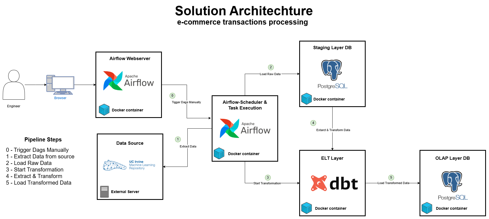

# E-Commerce Transactions Processing Project

This project aims to simulate the batch processing of transactions generated by an e-commerce platform. The data source that will act as our e-commerce service is the Online Retail Dataset - UC Irvine ([Check Raw Metada Documentation](project_documentation/data_modeling/raw_metada_doc.md)). 

Using a containerized architecture involving Docker, Airflow, Python, DBT, and PostgreSQL (staging layer and OLAP layer), the goal is to transform this source data into an analytical model that enables the organization to make informed decisions.

## Architecture Overview

This architecture was designed to run in a local environment using Docker to set up the different services it comprises.

For more information about the architecure components ([Check Solution Architecture Documentation](project_documentation/architechture_documentation/solution_architecture.md)).

The processing pipeline involved in the architecture is the next:

### Processing Pipeline

0. **Trigger Dags Manually (Optional):** An Engineer can trigger manually the Dag developed using Arflow Webserver to start the execution.

1. **Extract Data from source:** An airflow task extract data from UC Irvine repositories.

2. **Load Raw Data:** After a simple preprocessing process of the data obtained in the last step, An airflow task load the raw data into the PostgreSQL stating area waiting to be transformed.

3. **Start Transformation:** An ariflow task also is in charged of start the transformation process invoking the dbt container.

4. **Extract & Transform:** DBT transforms the data in the staging layer into an analitical model.

5. **Load Transformed Data:** DBT ingest data into OLAP layer. This data can be used now for BI, analitical purposes and decision making.




## OLAP Layer - Star Model

The raw data is transformed into an star schema thats going to be stored in the postgres OLAP Layer. This new denormalized model allows for more agile queries that will support the company in the process of becoming a data-driven company.

For more information [Check OLAP Data Model & Metadata Documentation](project_documentation/data_modeling/olap_metadata_doc.md)


## Repository Structure

## CI/CD Approach

A Makefile was generated to provide a set of targets for managing Docker Compose deployments in a Python and Docker environment. It simplifies tasks such as checking for required dependencies (Python and Docker), building and starting Docker containers, running DBT tasks, and cleaning up unused Docker resources. It is particularly useful for automating deployment pipelines in a Continuous Integration/Continuous Deployment (CI/CD) environment.

### Key Components and Purpose

1. **Automated Dependency Checks**:
   - Ensures that the required dependencies (Python and Docker) are installed before starting the build process, preventing errors from missing dependencies.

2. **Automated Builds and Deployments**:
   - The `build`, `up`, `restart`, and `rebuild` targets help automate the process of building, deploying, and restarting services, which are key steps in any CI/CD pipeline. This eliminates the need for manual intervention and reduces errors during deployment.

3. **System Cleanup**:
   - The `clean` and `stop` targets help in cleaning up unused Docker resources, ensuring that system resources are not wasted by lingering containers, networks, or volumes, which is critical for maintaining a clean and efficient environment during continuous deployment.

4. **Real-time Monitoring**:
   - The `logs` target allows the real-time monitoring of services, which is important for debugging and ensuring the services are functioning as expected during the CI/CD process.

5. **DBT Task Execution**:
   - The `dbt` target ensures that data transformation tasks can be executed within the Docker environment, making the deployment of data-related tasks part of the CI/CD pipeline.

### Example Targets

```bash
# Build the Docker images and start the services
make build   # This will build the Docker images defined in the Makefile and start the services.
# Restart services if needed
make restart  # Restarts the services, useful when you need to apply changes without fully stopping.
# Stop the services
make stop     # Stops all running services, which can be used to pause or shut down your environment.
# Clean up Docker resources
make clean    # Removes unused Docker resources such as stopped containers, networks, and dangling images.
# View logs for services
make logs     # Displays the logs of the running services to help you troubleshoot or monitor service output.
# Run DBT tasks
make dbt      # Runs the DBT (Data Build Tool) tasks defined in the Makefile, typically for transforming data.
```

## Suggested architecture changes for real-world implementations

For a real worl implementation of this solution it would be more 

Esta solución fue pensada para correr en un ambiente local, sin embargo para una implementacion en el mundo real no seria la mas adecuda. Se podria cambiar el ambiente local por un entorno en la nube usando servicios serverless de AWS.

Orquestration:  Amazon Managed Workflows for Apache Airflow (MWAA)
Datalakes: AWS S3 
Computing: AWS Glue Jobs (con pyspark para cargas de trabajo pesadas)
Datawarehouse: Redshift

## Relevant commands to check status on container services

These commands help you manage your Docker containers, Airflow DAGs, DBT workflows, and Python virtual environments efficiently.

### Docker Commands

- `docker ps`: Lists all running containers.
- `docker ps -a`: Lists all containers, including stopped ones.
- `docker-compose up --build`: Builds and starts the services defined in the `docker-compose.yml` file.
- `docker-compose up --build -d`: Builds and starts the services in detached mode (runs in the background).
- `docker-compose down -v`: Stops and removes containers, networks, and volumes defined in the `docker-compose.yml` file.

### Airflow Commands

- `docker exec -it airflow airflow dags list`: Lists all the DAGs (Directed Acyclic Graphs) currently available in Airflow.
- `docker exec -it airflow_webserver airflow dags list-import-errors`: Lists any errors encountered when importing DAGs into Airflow.

### DBT Commands

- `docker exec -it dbt-container bash`: Opens a bash shell inside the DBT container.
- `docker exec -it dbt-container dbt debug`: Runs a debug check in the DBT container to ensure your project is configured correctly.

#### DBT Workflow Commands

- `dbt debug`: Checks the DBT project's health and connectivity to the database.
- `dbt compile`: Compiles the DBT project, preparing it for execution.
- `dbt run`: Executes the DBT project, running the SQL transformations on the database.

### Python Virtual Environment Commands

- `python -m venv venv`: Creates a new virtual environment in the `venv` directory.
- `.\venv\Scripts\activate`: Activates the virtual environment on Windows.
- `deactivate`: Deactivates the current Python virtual environment.
