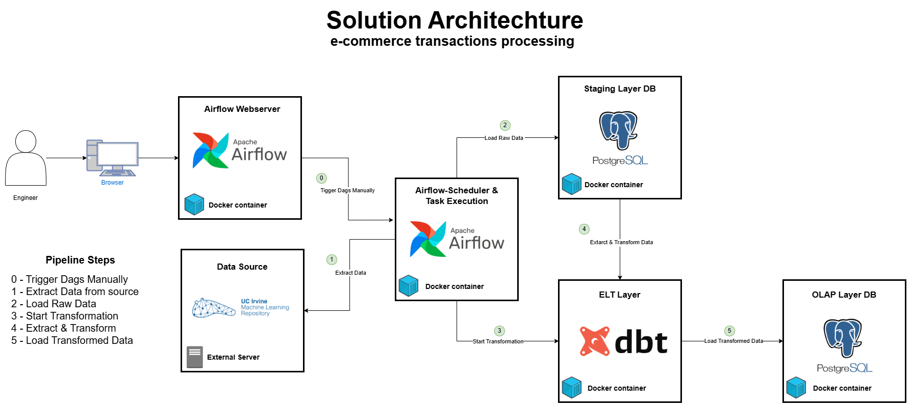

# Solution Architecture Documentation

This document provides an overview of the services defined in the Docker Compose file. The pipeline is designed to extract, transform, and load (ETL) data using **Apache Airflow** and **DBT** for data transformation. It uses two PostgreSQL databases: one for the staging layer (raw data) and another for the OLAP layer (transformed data).

## 1. **Airflow Webserver (`airflow_webserver`)**

- **Purpose**: Provides the web-based UI for Apache Airflow.
- **Role in the Pipeline**:
  - Manages and monitors the execution of Airflow DAGs (Directed Acyclic Graphs).
  - Engineers can manually trigger DAGs via the UI to start the data pipeline.
  - Displays the status and logs of each task executed in the pipeline.
- **How it Works**:
  - Upon triggering, the webserver communicates with the Airflow scheduler to initiate the task execution.

---

## 2. **Airflow Scheduler (`airflow-scheduler`)**

- **Purpose**: Executes the scheduled tasks of Airflow DAGs.
- **Role in the Pipeline**:
  - Schedules and runs tasks defined in the DAGs.
  - Ensures that tasks like data extraction, transformation, and loading are executed at the correct times.
- **How it Works**:
  - Works in conjunction with the `airflow_webserver` to run tasks and monitor their progress.

---

## 3. **Staging Layer Database (`staging_layer_db`)**

- **Purpose**: Stores raw data from external sources (e.g., UC Irvine repositories) before it is transformed.
- **Role in the Pipeline**:
  - Stores the extracted raw data from external sources.
  - Data is loaded into this database via an Airflow task after a basic preprocessing step.
- **How it Works**:
  - Serves as the temporary repository for unprocessed data, waiting to be transformed into a more usable format.

---

## 4. **OLAP Layer Database (`olap_layer_db`)**

- **Purpose**: Stores the transformed data in an analytical format for reporting and decision-making.
- **Role in the Pipeline**:
  - Receives the transformed data from DBT after it has been processed and cleansed.
  - Stores data in a format suitable for BI (Business Intelligence) and analysis.
- **How it Works**:
  - After data is transformed by DBT, it is loaded into the OLAP database, making it available for querying and analytical purposes.

---

## 5. **DBT (Data Build Tool) Container (`dbt`)**

- **Purpose**: Transforms raw data into structured and analytical models using DBT.
- **Role in the Pipeline**:
  - Transforms data from the **staging layer** into an analytical model using SQL-based transformations.
  - Loads the transformed data into the **OLAP layer** for further use.
- **How it Works**:
  - After Airflow triggers the DBT container, it uses DBT to process the raw data in the staging layer and create a structured model in the OLAP layer.
  - This container connects to both the staging and OLAP databases to perform data transformation and loading.

---

## Data Pipeline Workflow

1. **Trigger DAGs**: Engineers can trigger the DAG manually through the Airflow web interface to start the pipeline execution.
2. **Extract Data from Source**: Data is extracted from UC Irvine repositories or other sources through an Airflow task.
3. **Load Raw Data into Staging Layer**: Raw data is loaded into the staging database after basic preprocessing.
4. **Start Transformation**: Airflow triggers the DBT container to start transforming the raw data into an analytical model.
5. **Extract & Transform**: DBT processes and transforms the raw data into structured models in the staging database.
6. **Load Transformed Data into OLAP Layer**: Transformed data is loaded into the OLAP database for use in business intelligence and analytics.

---

## Networking & Communication

All services are connected through a custom `airflow_network`, ensuring smooth communication between containers. This network allows the Airflow components (webserver and scheduler), PostgreSQL databases (staging and OLAP), and the DBT container to communicate efficiently and perform their tasks in an orchestrated manner.

---

## Conclusion

This setup provides an automated, scalable ETL pipeline using **Airflow** and **DBT**. It handles the extraction, transformation, and loading of data from source systems to analytical databases, supporting business intelligence and decision-making processes.