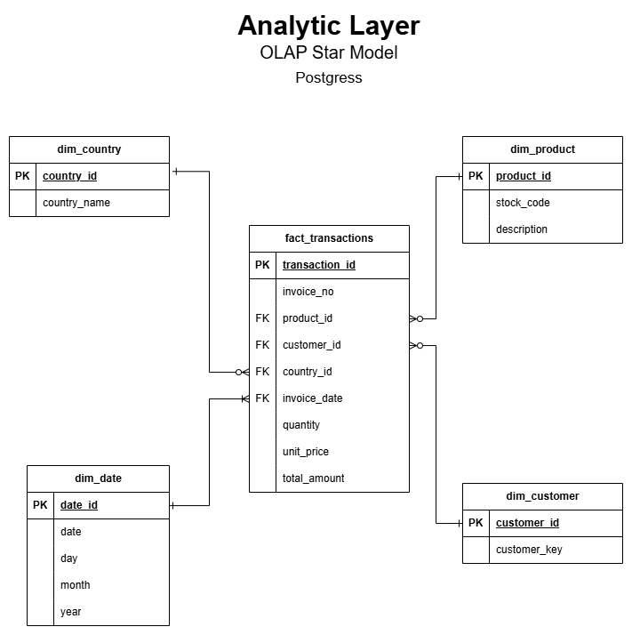

# OLAP Data Model & Metadata Documentation

This document provides metadata for the OLAP data model implemented for the e-commerce data pipeline project. The model is designed as a star schema, with `Fact_Transactions` as the central fact table and supporting dimension tables (`Dim_Product`, `Dim_Customer`, `Dim_Country`, and `Dim_Date`).

---

## Table: Fact_Transactions
**Purpose**: This table stores the transactional data for each e-commerce transaction, including quantities, unit prices, and total amounts.

| **Column**       | **description**                                  | **Data Type** | **Notes**                         |
|-------------------|--------------------------------------------------|---------------|------------------------------------|
| transaction_id    | Unique identifier for each transaction.          | Integer       | Surrogate Key.                    |
| invoice_no        | Invoice number from the raw data.                | String        | Natural key from the source data. |
| invoice_date      | Date of the transaction.                         | Date          | FK to `Dim_Date`.                 |
| customer_id       | Customer involved in the transaction.            | Integer       | FK to `Dim_Customer`.             |
| product_id        | Product sold in the transaction.                 | Integer       | FK to `Dim_Product`.              |
| country_id        | Country where the transaction occurred.          | Integer       | FK to `Dim_Country`.              |
| quantity          | quantity of products sold in the transaction.    | Integer       | -                                 |
| unit_price        | Price per unit of the product.                   | Decimal       | -                                 |
| TotalAmount       | Total transaction value (quantity * unit_price).  | Decimal      | Derived during transformation.    |

---

## Table: Dim_Product
**Purpose**: This dimension table describes the products involved in the transactions.

| **Column**       | **description**                                  | **Data Type** | **Notes**                         |
|-------------------|--------------------------------------------------|---------------|------------------------------------|
| product_id        | Unique identifier for each product.              | Integer       | Surrogate Key.                    |
| stock_code        | Original stock code from the source data.        | String        | Natural key from the source data. |
| description       | Text description of the product.                 | String        | -                                 |

---

## Table: Dim_Customer
**Purpose**: This dimension table contains information about customers.

| **Column**       | **description**                                  | **Data Type** | **Notes**                         |
|-------------------|--------------------------------------------------|---------------|------------------------------------|
| customer_id       | Unique identifier for each customer.             | Integer       | Surrogate Key.                    |
| CustomerNaturalID | Original customer identifier from the source.    | String        | Natural key from the source data. |
| Name              | Full name of the customer (if available).        | String        | Optional field for enhancement.   |

---

## Table: Dim_Country
**Purpose**: This dimension table contains information about countries where transactions occur.

| **Column**       | **description**                                  | **Data Type** | **Notes**                         |
|-------------------|--------------------------------------------------|---------------|------------------------------------|
| country_id         | Unique identifier for each country.              | Integer       | Surrogate Key.                    |
| CountryName       | Name of the country (e.g., "Denmark").           | String        | -                                  |
| Region            | Geographical region (e.g., "Europe").            | String        | Optional field for regional analytics.|

---

## Table: Dim_Date
**Purpose**: This dimension table provides detailed information about dates for time-based analysis.

| **Column**       | **description**                                  | **Data Type** | **Notes**                         |
|-------------------|--------------------------------------------------|---------------|------------------------------------|
| DateID           | Unique identifier for each date (YYYYMMDD).      | Integer       | Surrogate Key.                    |
| Date             | The actual calendar date.                        | Date          | -                                  |
| Year             | The year part of the date.                       | Integer       | -                                  |
| Quarter          | The quarter of the year (1-4).                   | Integer       | -                                  |
| Month            | The month part of the date (1-12).               | Integer       | -                                  |
| MonthName        | Full name of the month (e.g., "November").       | String        | -                                  |
| Day              | Day of the month.                                | Integer       | -                                  |
| Weekday          | Name of the day (e.g., "Friday").                | String        | -                                  |
| IsWeekend        | Boolean indicating if the date is a weekend.     | Boolean       | True for Saturday/Sunday.         |

---

## Relationships
The data model follows a star schema design. The relationships between tables are:

- `Fact_Transactions.product_id` → `Dim_Product.product_id`
- `Fact_Transactions.customer_id` → `Dim_Customer.customer_id`
- `Fact_Transactions.country_id` → `Dim_Country.country_id`
- `Fact_Transactions.invoice_date` → `Dim_Date.DateID`