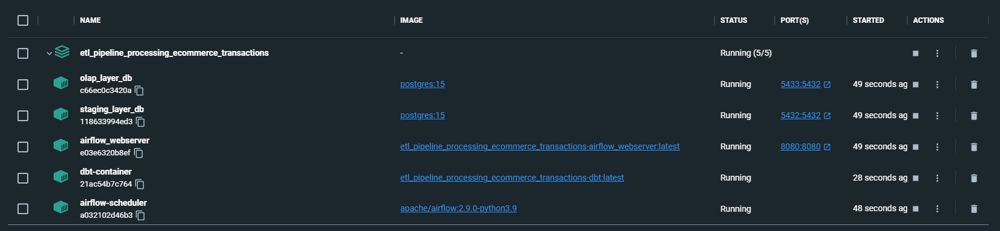
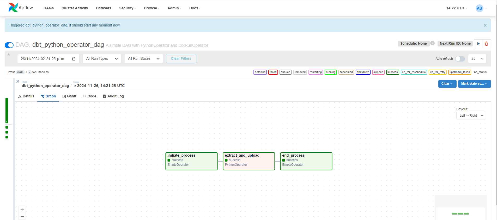
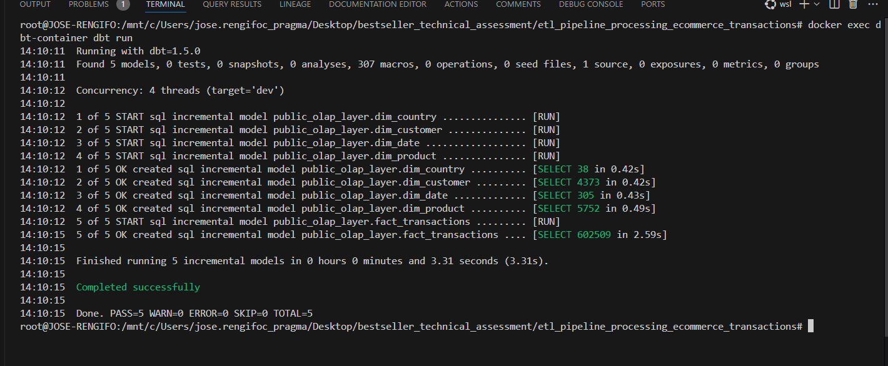
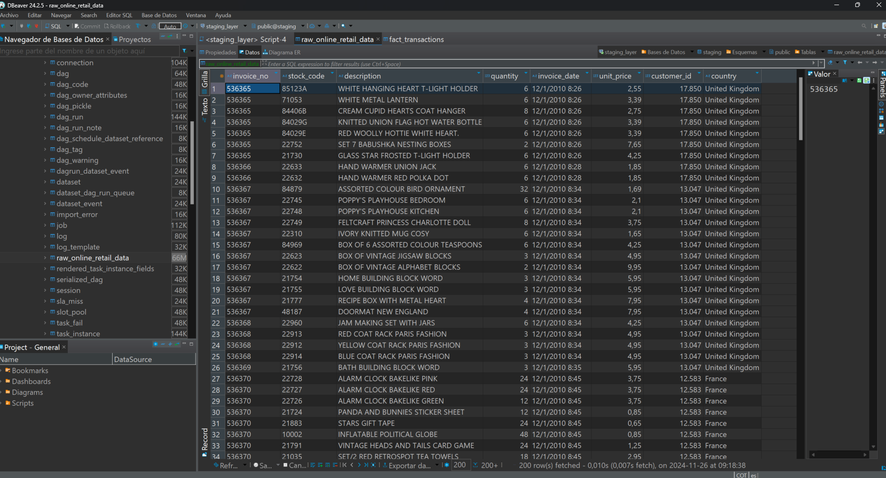
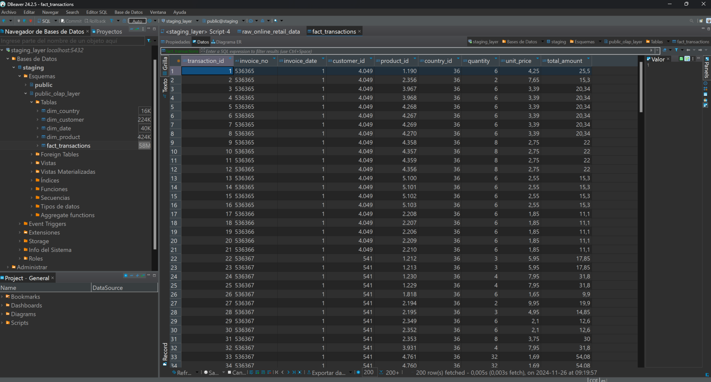
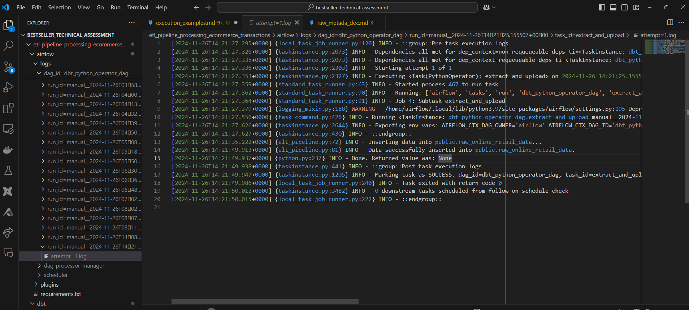
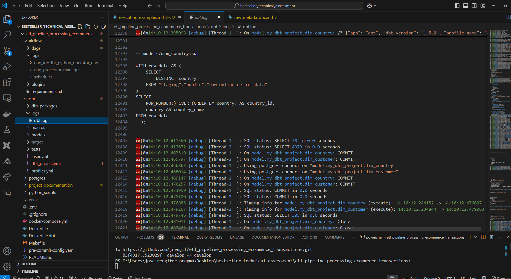

# Execution demonstration

## Docker destktop

Once the ```make up ``` command is executed all the 5 containers must look like this.



## Airflow running

When you access through th airflow webserver the DAG execution must look like this.



## DBT Run command

when the dbt run command is executed all 5 5 tables of the olap model must be processed succesfully



## Ingestion in staging layer

Raw data must look like this in a DB client like DBeaver



## Ingestion in olap layer

OLAP data must look like this in a DB client like DBeaver



## Airflow logs in local

Logs for airflow can be checked through local folder



## DBT logs in local

Logs for DBT can be checked through local folder


